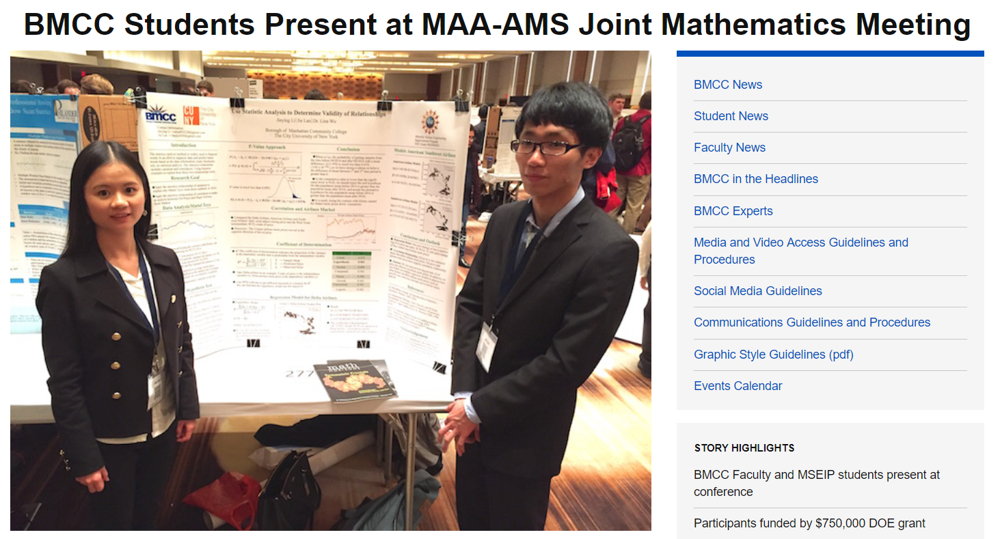

# Determine Validity of Relationships –Causation and Correlation
BMCC news: https://www.bmcc.cuny.edu/news/news.jsp?id=13488

## research content

* Minority Science and Engineering Improvement Program: Collected data on major airlines’ stock prices and oil prices from 1986 to 2016. 
* We used SPSS and R language to build multiple regression models to analyze airlines’ stock prices and oil prices.
* Our team presented original research at the 2017 Joint Mathematics Meetings (Jan 2017). 

## License

    Copyright [Jie Lan] [name of copyright owner]

    Licensed under the Apache License, Version 2.0 (the "License");
    you may not use this file except in compliance with the License.
    You may obtain a copy of the License at

        http://www.apache.org/licenses/LICENSE-2.0

    Unless required by applicable law or agreed to in writing, software
    distributed under the License is distributed on an "AS IS" BASIS,
    WITHOUT WARRANTIES OR CONDITIONS OF ANY KIND, either express or implied.
    See the License for the specific language governing permissions and
    limitations under the License.
